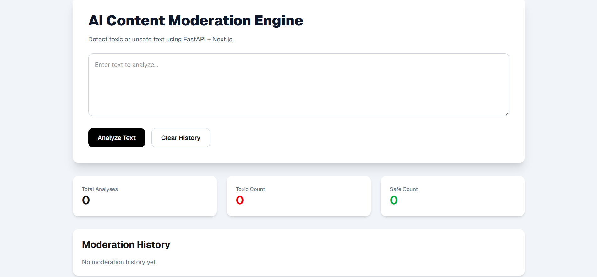
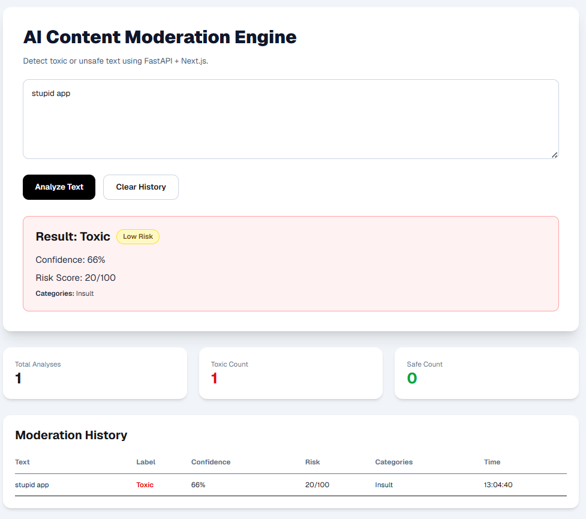
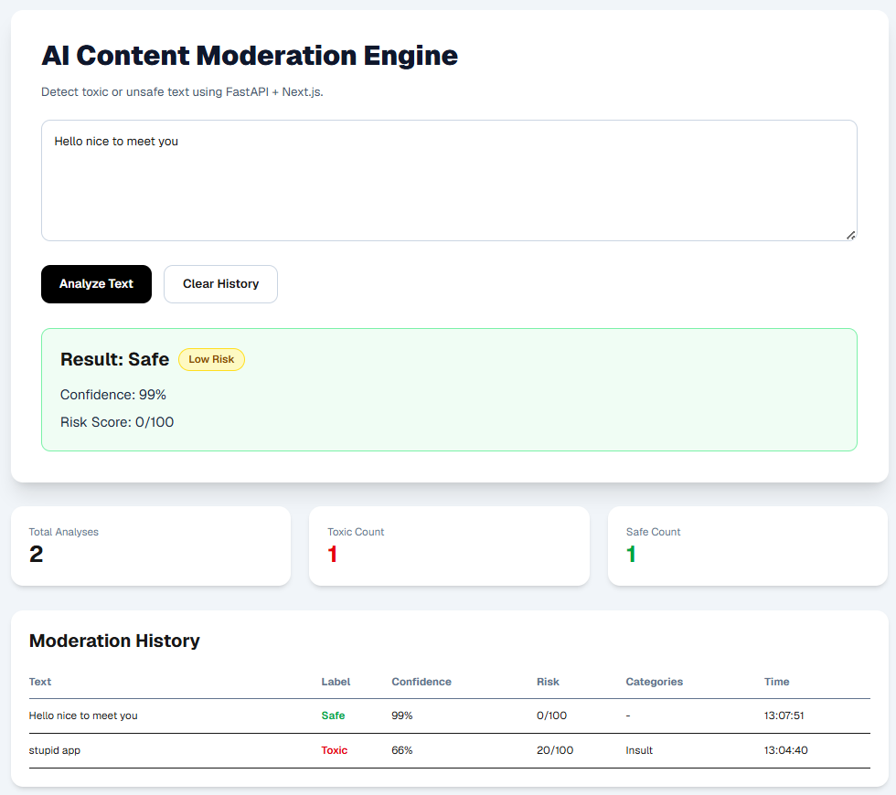
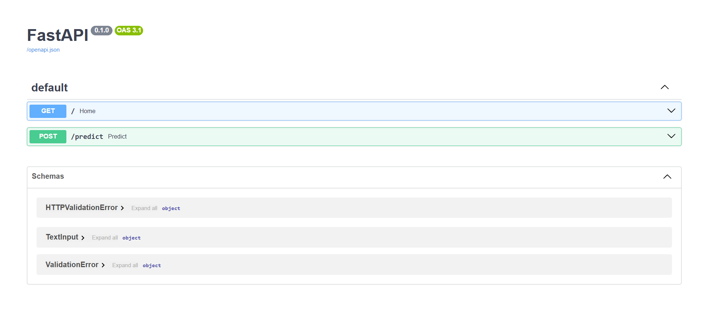

# AI Content Moderation Engine

A full-stack content moderation application that analyzes user-submitted text, detects potentially toxic language, assigns risk scores, categorizes harmful content, and maintains moderation history.

## Live Demo

**Frontend Application**
https://ai-content-moderation-engine-production-aa71.up.railway.app/

**Backend API Documentation**
https://ai-content-moderation-engine-production.up.railway.app/docs

---

## Overview

The AI Content Moderation Engine is a web application designed to identify potentially harmful or toxic text in real time. Users can submit text through a modern web interface and receive moderation results including toxicity classification, confidence score, risk score, and content category.

The project demonstrates full-stack development, API integration, cloud deployment, and frontend-backend communication using modern web technologies.

---

## Features

* Real-time text moderation
* Toxic vs Safe classification
* Risk scoring system (0–100)
* Content categorization
* Moderation history tracking
* Analysis statistics dashboard
* REST API backend
* Public cloud deployment

---

## Tech Stack

### Frontend

* Next.js 16
* React 19
* TypeScript
* Tailwind CSS

### Backend

* FastAPI
* Python
* Pydantic

### Deployment & DevOps

* Railway
* GitHub
* Git

---

## Project Architecture

Frontend (Next.js)
↓
REST API
↓
FastAPI Backend
↓
Moderation Engine
↓
Risk Analysis & Categorization

---

## Screenshots

### Homepage



### Toxic Content Detection



### Safe Content Detection



### API Documentation



---

## Running Locally

### Backend

```bash
cd backend
pip install -r requirements.txt
uvicorn main:app --reload
```

Backend runs at:

```text
http://localhost:8000
```

### Frontend

```bash
cd frontend
npm install
npm run dev
```

Frontend runs at:

```text
http://localhost:3000
```

---

## API Example

### Request

```json
{
  "text": "stupid app"
}
```

### Response

```json
{
  "label": "Toxic",
  "confidence": 66,
  "risk_score": 20,
  "matched_words": ["stupid"],
  "categories": ["Insult"]
}
```

---

## Skills Demonstrated

* Full-Stack Development
* REST API Design
* Frontend-Backend Integration
* Cloud Deployment
* API Testing
* Git & GitHub Workflow
* TypeScript Development
* Python Backend Development

---

## Future Enhancements

* Advanced NLP models
* User authentication
* Admin moderation dashboard
* Analytics reporting
* Multi-language support
* Database persistence

---

## Author

Sri Krishna Chaitanya

GitHub: https://github.com/srikco06-ai
